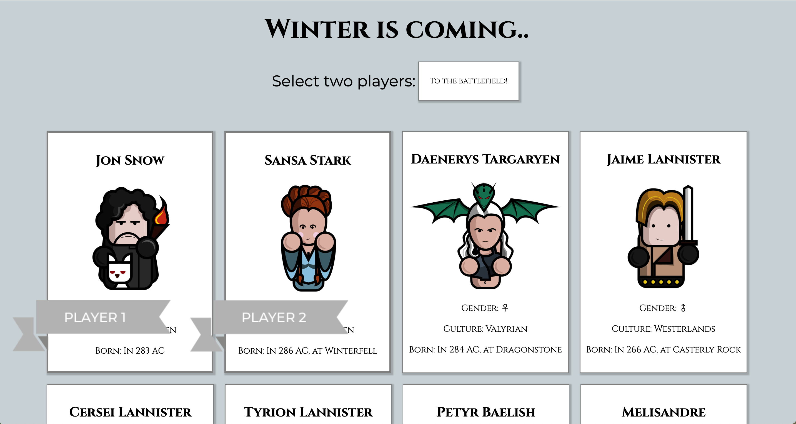

# Semester Project 2



## Description

Semester Project 2 assignment at Noroff School of Technology and Digital Media.
Creating a Game of Thrones themed board game fetching characters from an API.

- The player must only be able to select two characters to play with.
- When starting the game, the selected players move over to the board.
- Roll the dice to move the players on the board. The dice should only be abole to roll a number between 1-6, and if a six is rolled the same player get another turn. The application will swap out turns between the players depending on whos turn it is to roll the dice.
- The board game should contain 30 tiles for the players to move on, with a minimum of five traps or penalties.
- When one of the players reaches the end of the board, that player wins the game.

## Built With

- Vanilla JavaScript
- HTML
- CSS

## Getting Started

### Installing

How to get started, step by step:

1. Clone the repo:

```bash
git https://github.com/Annikaenjoy/semester_project2.git
```

2. Install the dependencies:

```
npm install
```

### Running

To run the app, run the following commands:

```bash
npm run start
```

## Contributing

Thank you for taking the time to contribute!
Please make sure to read the relevant section before making your contribution. It will make it a lot easier for us maintainers and smooth out the experience for all involved.

> ### Legal Notice
>
> When contributing to this project, you must agree that you have authored 100% of the content, that you have the necessary rights to the content and that the content you contribute may be provided under the project license.

## Contact

This is where you can leave your social links for people to contact you, such as a LinkedIn profile or Twitter link e.g.

[My LinkedIn page](https://www.linkedin.com/in/annika-louise-eng%C3%B8y-b1959b1a4/)

## Acknowledgments

All characters are illustrated by Nguyen Nguyen.
Link: https://www.behance.net/gallery/10785977/Characters-of-Game-of-thrones

This guide is based on the **contributing.md**. [Make your own](https://contributing.md/)!
